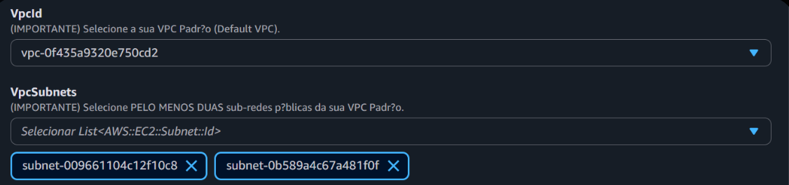

# Desafio: Infraestrutura Automatizada com AWS CloudFormation

Este repositório documenta a implementação de uma infraestrutura de aplicação web automatizada, utilizando AWS CloudFormation, como parte do bootcamp.

## 1. Objetivo

O objetivo deste desafio foi evoluir do conceito de "primeira stack" para uma "infraestrutura automatizada". O foco foi provisionar um ambiente de aplicação web completo, escalável e resiliente, usando os princípios de **Infraestrutura como Código (IaC)**.

## 2. Cenário Prático: Backend da Aplicação de Hotelaria

Para este desafio, traduzi a arquitetura de EC2 que desenhei anteriormente para um template CloudFormation. O objetivo é criar automaticamente toda a infraestrutura de backend para o **Sistema de Hotelaria**.

A arquitetura provisionada consiste em:
* **VPC e Sub-redes:** Utiliza a VPC Padrão da conta, com sub-redes.
* **Application Load Balancer (ELB):** A porta de entrada pública.
* **Auto Scaling Group (ASG):** O "gerente" que garante que sempre tenhamos 2 (Min) a 4 (Max) instâncias rodando.
* **Launch Template:** O "molde" para cada instância EC2, que define o tipo (`t2.micro`), a AMI e o script de inicialização.
* **Instâncias EC2:** Os servidores que rodam a aplicação, gerenciados pelo ASG.
* **Security Groups:** As regras de firewall (ex: ELB permite tráfego da internet, EC2s permitem tráfego *apenas* do ELB).

## 3. O Template

Este é o "coração" do desafio. É o arquivo YAML que descreve toda a infraestrutura.

## 4. Anotações e Insights da Implementação

Este foi o desafio mais prático e com mais aprendizados. O processo não funcionou de primeira e exigiu depuração (debugging) lendo os eventos da stack, o que foi a parte mais importante.

### a. O Processo de Depuração (Debugging)

Durante a criação da stack, encontrei vários erros de `ROLLBACK_COMPLETE`. A chave foi ler a aba "Events" para entender o motivo:

1.  **Erro 1: `No export named DefaultVPC-Subnets found.`**
    * **Causa:** O template original tentava "importar" automaticamente as sub-redes da VPC padrão.
    * **Solução:** Modifiquei o template para *pedir* a VPC e as Sub-redes como `Parameters` de entrada. Isso tornou o template mais flexível e resolveu o problema.

2.  **Erro 2: `extraneous key [HealthCheck] is not permitted`**
    * **Causa:** No recurso `AppTargetGroup`, eu havia agrupado as configurações de "HealthCheck" dentro de um bloco, mas o CloudFormation espera cada propriedade (como `HealthCheckPath`, `HealthCheckIntervalSeconds`) individualmente.
    * **Solução:** Corrigi a sintaxe do YAML, "achatando" a estrutura do `HealthCheck`.

3.  **Erro 3: `Character sets beyond ASCII are not supported.`**
    * **Causa:** Eu havia escrito a `GroupDescription` dos Security Groups em português, usando acentos ("Permite tráfego..."). O CloudFormation não aceita caracteres especiais nesses campos.
    * **Solução:** Traduzi as descrições para inglês simples (ASCII), sem acentos (ex: "Allows HTTP traffic...").

### b. "UserData" (A Automação)
O bloco `UserData` no `LaunchTemplate` é a "mágica" da automação. É um script que executa automaticamente na primeira vez que a EC2 liga. No meu caso, ele instalou e iniciou um servidor web Apache.

### c. A Importância dos "Outputs"
Após a stack ser criada (`CREATE_COMPLETE`), a aba **"Outputs"** me deu o link `LoadBalancerDNS`. Ao acessar esse link no navegador, pude ver a página "Servidor Web (Hotelaria)..." e confirmar que *toda* a infraestrutura (ELB, ASG, EC2, UserData) funcionou de ponta a ponta.

## 5. Conclusão

Este desafio conectou todos os pontos. Traduzi um **diagrama de arquitetura** (ELB -> ASG -> EC2) em um **arquivo de código** (YAML) que pode ser versionado no Git.

A experiência de depurar os erros (`ROLLBACK`) foi o maior aprendizado, pois me forçou a ler a documentação e entender exatamente o que cada linha do template faz.

Com esta stack, posso agora criar e destruir ambientes de aplicação complexos em minutos, de forma 100% consistente.
